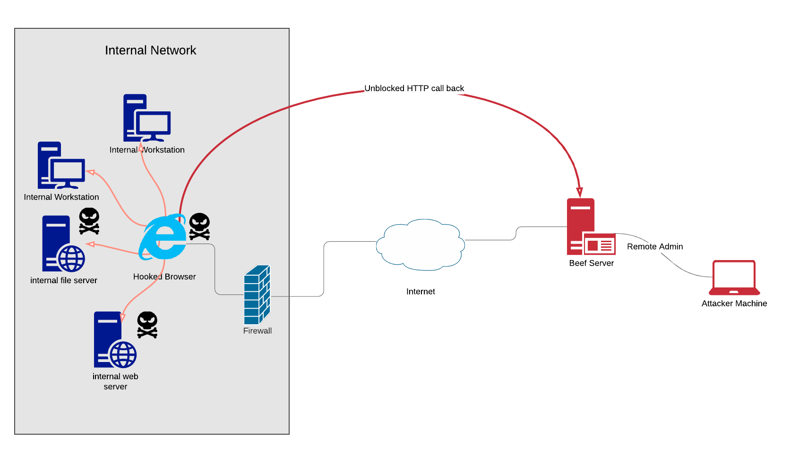
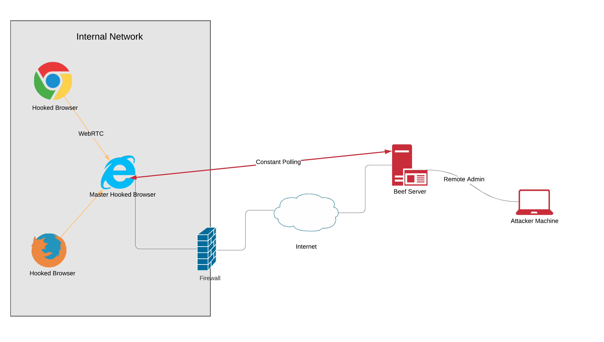
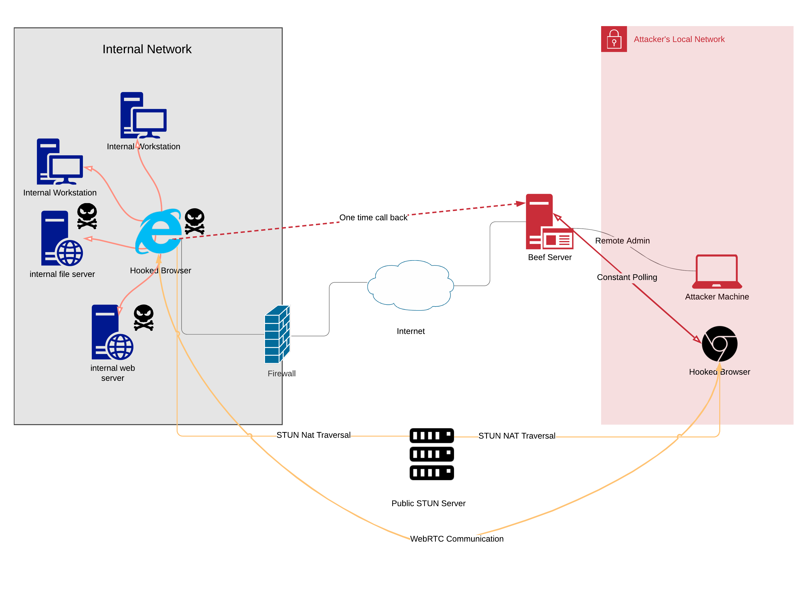

## Architecture Diagram


## File Organization

All relative file paths described below are from the root folder of beef.

For the Kali Linux repo installation, the path would be `/usr/share/beef-xss`. Note that is not the most up to date version of beef, so for new features and fixes, pulling from git would be recommended.

### SQLite Database

`beef.db` - the SQLite database file used by beef

In the kali install, it's in `/usr/share/beef-xss/db/beef.db`

### config file

`config.yaml` is the global config file for beef. In the kali install, it's in `/etc/beef-xss/config.yaml`

### modules

Modules define extra functionality for controlling hooked browsers.

Modules are stored in the `modules/` folder like so:

`modules/<category>/<module_name>/`

the naming convention of folder and file names are **all lowercase**.

3 files are stored in each module folder: 

| file 		   | purpose							  |
|--------------|--------------------------------------|
|`config.yaml` | module information and config        |
| `command.js` | the javascript to execute in browser |
| `module.rb`  | backend ruby class definition        |

### extensions

Extensions change/extend the way BeEF behaves.

The files are stored in the `extensions/` folder like so:
`extensions/<name>/`

files stored in each extension folder:

| file 		   | purpose							             | necessary |
|--------------|-------------------------------------------------|-----------|
|`extension.rb` | necessary, define classes for the extension    | *		 |
|`config.yaml` | extension information and config               | *          |

for more information on extensions, see [[Creating An Extension|Creating-An-Extension]]

Extensions can hook (and mount) paths in the REST API. They are mounted at a path relative to beef's server root, for example, the code below extracted from `extensions/admin_ui/api/handler.rb` hooks a minified static Javascript file: 

```ruby

config = BeEF::Core::Configuration.instance
bp = config.get "beef.extension.admin_ui.base_path"

auth_js_file = File.read(File.dirname(__FILE__)+'/../media/javascript/ui/authentication.js') + "\n\n"
web_ui_auth = self.evaluate_and_minify(auth_js_file, params, 'web_ui_auth')

beef_server.mount("#{bp}/web_ui_auth.js", Rack::File.new(web_ui_auth))

```

### REST API

The REST API is the main way to interact with the core of BeEF, usable both via the admin UI and normal HTTP requests (such as using curl)

The files are stored in `core/main/rest`.

`core/main/rest/api.rb` contains code that mounts/maps a route (HTTP URL path, such as /api/hooks) to an instance of a BeEF class for access.

`core/main/rest/handlers/<name>.rb` defines responses to different requests to the mounted classes.


### Admin UI

The admin UI is accessible via the BeEF web server on `/ui/panel`. You will be prompted to login if you are haven't. 

E.g. you can access it through localhost http://localhost:3000/ui/panel

The admin UI is treated as an extension, thus all code is stored in `extensions/admin_ui`.


### Console

The beef console is also an extension, but is currently out of support. There is active work being done to fix it. To try it out, run `./beef-console` in the beef-console branch (https://github.com/beefproject/beef/tree/beef-console)

For more information about how the console used to work, see [[BeEF-Console|BeEF-Console]]

The console does not use the REST API, but directly interacts with the database through ActiveRecord. In the <a href="https://github.com/beefproject/beef/tree/beef-console">beef-console</a> branch, `./beef-console` runs separately to the server instance, but is in-sync through the database.


## Networking

### typical setup with external BeEF server



Hooked browsers inside the internal network call out to the external beef server when hooked, using normal web traffic (usually on the default ports 80/443). This allows the attacker to bypass firewall controls to scan and exploit internal infrastructure through the hooked browser (especially HTTP-like services).

The flaw with this setup is that the organization network and the host computer which the hooked browser belongs to constantly reach out to BeEF, which increases the risk of exposing the BeEF endpoint if the network is being monitored.

### WebRTC mesh setup - internal browsers

One setup to avoid the noise is to have one "master" hooked browser constantly talk to the BeEF server, while other hooked browsers in the same internal network will use WebRTC to setup p2p communication with the master hooked browser. This way, only one host is talking back to the BeEF server so things are less noisy.



For more information regarding using WebRTC with BeEF, read https://blog.beefproject.com/2015/01/hooked-browser-meshed-networks-with_26.html

### WebRTC mesh setup - external master browser

You may be thinking that is still too noisy. Since WebRTC is a peer-to-peer protocol, it is possible to traverse NAT (Network Address Translation) using public STUN servers, which is also built-in to the WebRTC extension in BeEF.

Thus it is possible to use a hooked browser that is in the attacker's network to control the other hooked browsers via WebRTC, with either one initial connection to the BeEF server to establish command and control, or embed this functionality straight in the Javascript hook executed. This way, if the master browser's IP address is different than the BeEF server, exposure of the IP of the BeEF server can be limited.



***

[[Development Organization|Development-Organization]] | [[Javascript API|Javascript-API]]