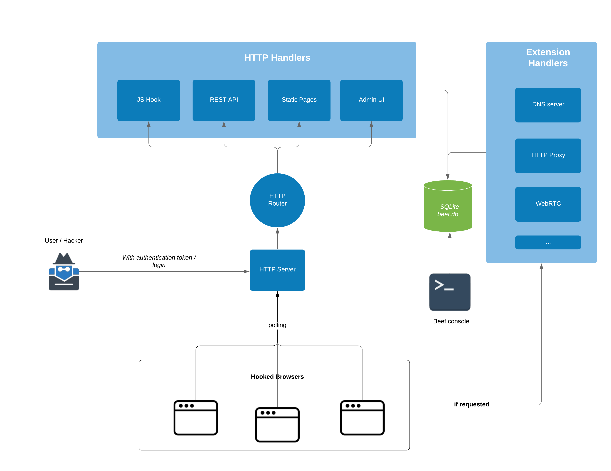

## Architecture Diagram

## File Organization

All relative file paths described below are from the root folder of beef.

For the Kali Linux repo installation, the path would be `/usr/share/beef-xss`. Note that is not the most up to date version of beef, so for new features and fixes, pulling from git would be recommended.

### SQLite Database

`beef.db` - the SQLite database file used by beef

In the kali install, it's in `/usr/share/beef-xss/db/beef.db`

### config file

`config.yaml` is the global config file for beef. In the kali install, it's in `/etc/beef-xss/config.yaml`

### modules

Modules define extra functionality for controlling hooked browsers.

Modules are stored in the `modules/` folder like so:

`modules/<category>/<module_name>/`

the naming convention of folder and file names are **all lowercase**.

3 files are stored in each module folder: 

| file 		   | purpose							  |
|--------------|--------------------------------------|
|`config.yaml` | module information and config        |
| `command.js` | the javascript to execute in browser |
| `module.rb`  | backend ruby class definition        |

### extensions

Extensions change/extend the way BeEF behaves.

The files are stored in the `extensions/` folder like so:
`extensions/<name>/`

files stored in each extension folder:

| file 		   | purpose							             | necessary |
|--------------|-------------------------------------------------|-----------|
|`extension.rb` | necessary, define classes for the extension    | *		 |
|`config.yaml` | extension information and config               | *          |

for more information on extensions, see [[Creating An Extension|Creating-An-Extension]]

### REST API

The REST API is the main way to interact with the core of BeEF, usable both via the admin UI and normal HTTP requests (such as using curl)

The files are stored in `core/main/rest`.

`core/main/rest/api.rb` contains code that mounts/maps a route (HTTP URL path, such as /api/hooks) to an instance of a BeEF class for access.

`core/main/rest/handlers/<name>.rb` defines responses to different requests to the mounted classes.

## Networking

***

[[Development Organization|Development-Organization]] | [[Javascript API|Javascript-API]]