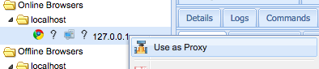

## Introduction

The proxy and requester extensions are designed to send requests through a victim browser. It tries to use cross origin requests, but will not work unless the target endpoint allows so. Most of the time, only same-origin requests will return responses.

## Configuration

To enable the two extensions, simply change enable to true in the config.yaml file(s).
The files are located in beef root `extensions/proxy/config.yaml` and `extensions/requester/config.yaml`

## Screenshots

### Use a hooked browser as proxy

### Use a hooked browser as proxy
